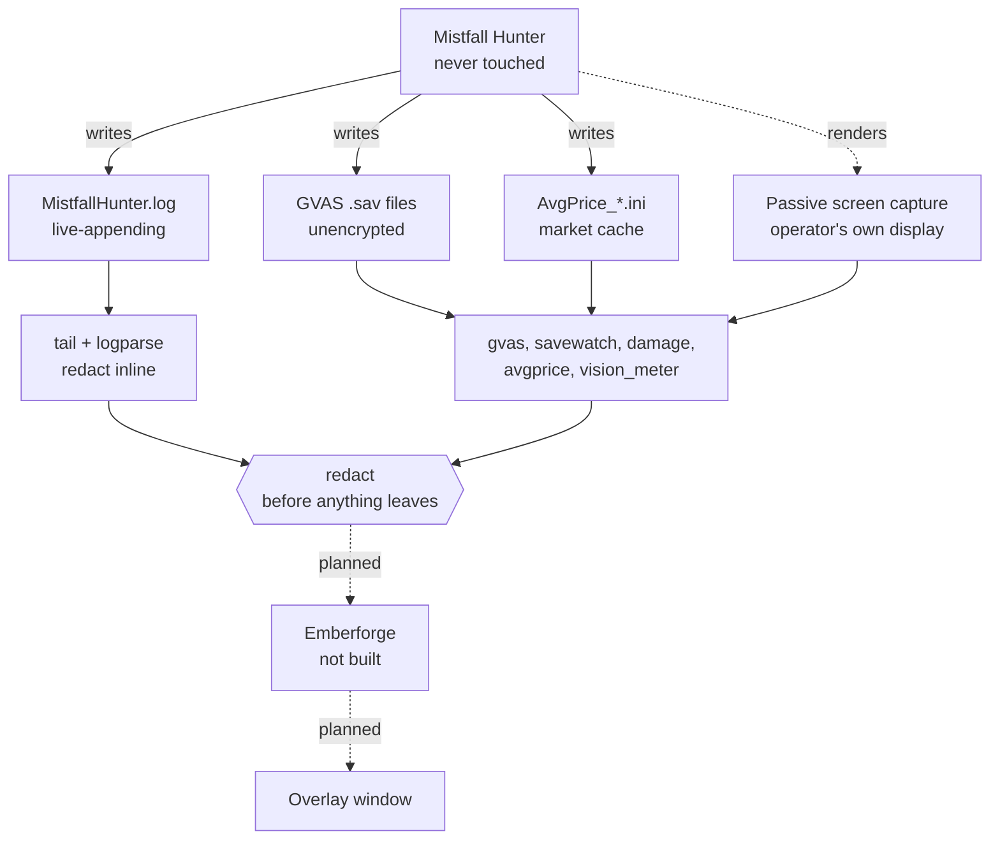

# Lanternlight

**Measure what the game never tells you - without ever touching the game.**

[](https://github.com/Remus3/Lanternlight/actions/workflows/tests.yml)

**Apache-2.0** &nbsp;|&nbsp; **Python 3.14** &nbsp;|&nbsp; **Windows** &nbsp;|&nbsp;
**Stdlib-only core** &nbsp;|&nbsp;
**[Never touches the game process](docs/adr/ADR-001-no-game-process-interaction.md)**

Lanternlight is a companion and analysis toolkit for **Mistfall Hunter** (Steam
appid 3282300), the dark fantasy PvPvE extraction ARPG by Bellring Games and
Skystone Games. It reads the log, save and cache files the game writes about
itself, joins them to passive screen capture, and derives build and combat
numbers that nobody has published.

**Emberforge** is the build and combat math engine at the centre of it. It
computes nothing yet, and it will not publish a number until that number has
been measured twice.

---

## Why it is built this way

Two measurements decided the whole architecture before a line of feature code
was written.

| Measured fact | What follows from it |
|---|---|
| The game ships **kernel-level anti-cheat** (Bellring Anti-Cheat, disclosed on the store page) | No injected plugin, no memory read, no packet capture, no hooked overlay, no synthetic input - permanently. [ADR-001](docs/adr/ADR-001-no-game-process-interaction.md) |
| **All 15 shipped pak chunks are AES-encrypted**, and a sweep of the whole install found zero loose game data files | There is no static data table to extract, and getting one would need the process access the rule above forbids. [ADR-002](docs/adr/ADR-002-no-asset-extraction.md) |

So Lanternlight does the opposite of a typical companion tool: **it touches
nothing**. That is a narrower surface than an injected tool would have. It is
also the only surface that is safe to use on an account you care about.

The second constraint follows from the first. Because nothing is extractable,
**no number here can be looked up - it has to be measured**. The hard
engineering problem is provenance: proving where every value came from, and
refusing to emit one that has no source. Where a value is unknown, Lanternlight
omits the field rather than guessing, and keeps *unmeasured* distinguishable
from *measured zero*.
[ADR-005](docs/adr/ADR-005-omit-rather-than-guess.md)

## Where the project is today

> **The measurement and operations layer is substantial. The product layer is
> not built yet.** The tables below say which is which.

Status as of 2026-09-14. Nothing below is aspirational, and each measurement
carries its own date in the document it links to.

### Built and measured

| Area | Notes |
|---|---|
| **GVAS save reader** | Every save parses with no unconsumed trailing bytes. Natively serialised structs are handed back verbatim and *named* undecoded rather than guessed. Published parsers do not work on this build: UE 5.4+ changed the property tag |
| **GVAS save writer** | `serialise(parse(raw)) == raw`, byte-identical on all 276 files of the 2026-08-10 corpus - an oracle that caught a flags word the reader was discarding |
| **Log parsing and live tail** | Survives in-place truncation and delete-and-recreate, splits bytes before decoding, and redacts before any sink |
| **Redaction** | Sees through base64, hex and raw UTF-16, scans binaries, and refuses to certify what it cannot assess |
| **Save and session watchers** | Snapshot every generation of every save, never write to the source, and name the surface that went stale |
| **Damage series reader** | Accumulates and deduplicates the game's rolling damage window. Found that the save's `timeStamp` is not a Unix epoch |
| **Market cache parser** | `AvgPrice_937566.ini` is parsed; the watcher is not built |
| **Class and id reference** | Class ids bound to names by a log-to-pixel wall-clock join, each binding recording the method that established it |
| **Overlay window** | A separate always-on-top window of our own. Placement and render are pure functions, so the panel is asserted on in CI |

### Partial

| Area | What is missing |
|---|---|
| **Weapon config ids** | The live id space is joined to item cfgIds, but the table is incomplete |
| **Raid and PvP data** | Solo explores are measured. No run with another player yet, so loot and extraction are **unmeasured, not absent** |
| **Affix ids** | Two remain unbound - 101 and 214 |
| **Meter OCR** | The training-ground meter's orange pair is read without a human in the loop. The white row is still open |

### Not built

| Area | State |
|---|---|
| **Emberforge** | Computes nothing yet. No coefficient is published until the same value appears in an independent run |
| **Dashboard** | Port 8810 reserved, nothing listening |
| **Packaged release** | No wheel, no installer, no tagged version |

## What is next

The open work splits into two gates.

**Measurements that need the game client, with a player at the keyboard.** The
ammo-family and talent tables, the Sorcerer single-weapon question, the
weapon-stance toggle, the stack buff at its ceiling, the last two affix ids, a
forward baseline after the client patch, the meter's white Progress Record row -
which needs a capture with longer stable stretches - and the first real raid.

Emberforge unblocks from here, and the input already exists: the game writes
per-hit damage with sub-millisecond timestamps, and the log binds damage to
ability names. What is missing is a second independent run of the same value.
Until then the overlay shows dashed rows rather than a fabricated one.

**Decisions that are parked.** A few items are waiting on a ruling rather than
on work.

Every open item carries an acceptance criterion in [`ROADMAP.md`](ROADMAP.md),
and every closed one is kept verbatim in
[`docs/ROADMAP_ARCHIVE.md`](docs/ROADMAP_ARCHIVE.md) - the shape of a bug is the
useful part.

## What it reads



Every arrow points **out of** the game. None point back, and none ever will.

- **The log**, at `%LOCALAPPDATA%\MistfallHunter\Saved\Logs\MistfallHunter.log` -
  the primary surface, and that is a decision rather than an accident
  ([ADR-003](docs/adr/ADR-003-log-is-primary-surface.md)).
- **GVAS saves** under the same tree - plain Unreal `GVAS`, unencrypted. A
  reader enumerates them rather than assuming, because one of them exists only
  for the duration of a run.
- **`AvgPrice_937566.ini`** - the market and trade-price cache.
- **Passive desktop capture** - the only route to values the game renders but
  never writes down. No overlay, no swapchain hook, no window hook.

The two dashed edges are not built: Emberforge computes nothing, so the overlay
is not fed from it yet.

**Where redaction actually sits.** The log reader redacts inline, because the log
is the surface that carries a SteamID64, a Steam persona, publisher SDK and EOS
account ids and an IP-resolved location. The other readers hand back what the
game wrote, and the redactor is the gate on the way OUT instead:
`ops.outbox.deliver` for anything sent off this machine, and
`tests/test_no_pii.py` for anything reaching a commit. The save watcher never
redacts a snapshot - it refuses any destination inside a repository working
directory, which is the same policy enforced at a different layer.
[ADR-004](docs/adr/ADR-004-redaction-is-mandatory.md)

## Quick start

```bash
git clone https://github.com/Remus3/Lanternlight
cd Lanternlight
python scripts/install_hooks.py
python -m pytest
```

`install_hooks.py` is not optional housekeeping: a fresh clone runs **zero** git
hooks until you run it, because `core.hooksPath` is local config and is never
cloned. See [`docs/OPERATIONS.md`](docs/OPERATIONS.md).

To see the overlay panel itself:

```bash
python -m overlay.window
```

It opens the always-on-top window with its waiting-for-data panel. Nothing is
computed yet, so the rows are dashed - that is the design, not a placeholder.

### Requirements

- **Windows** - the game, and the paths, are Windows-only
- **Python 3.14**
- **No third-party runtime dependencies in the library.** Pillow is imported
  lazily and only by the screen-capture and meter-OCR paths, and the vision
  tests do require it
- A local install of Mistfall Hunter, only if you want to run against real data.
  The tests do not need the game.

> Use `git clone`, not `git archive`. Dozens of tests ask `git` about the tree
> itself, so without a `.git` directory a source export reads as a broken
> checkout rather than as a clean one.

## How this repository works

Four rules, each enforced by tests, and each adopted after a measured failure.

1. **Never touch the game process.** There is no debug flag that makes an
   exception. If a feature needs one, the feature is rejected.
2. **Every change starts with a failing test.** Write it, watch it fail, then
   implement. Almost every fact here is a measurement, and a test is how a
   measurement stops being a memory.
3. **Omit rather than guess.** A missing number is recoverable; a confident
   wrong one poisons everything downstream of it.
4. **Redact before anything leaves the machine.** The log carries a SteamID64, a
   Steam persona, publisher SDK and EOS account ids, and an IP-resolved
   location.

<details>
<summary><b>Continuity - how a cold session picks this up</b></summary>

State lives on disk, never in a context window. `docs/LEDGER.md` is an
append-only record of what was decided and why, `ROADMAP.md` holds the open
items with their acceptance criteria, and `docs/adr/` holds the decisions that
are not open for re-litigation. Work runs in specialist lanes with enforced file
ownership so two lanes never race, and every "done" claim gets an independent
pass that is trying to refute it.

Both continuity documents are split rather than trimmed: the live file holds the
open and recent material, and
[`docs/ROADMAP_ARCHIVE.md`](docs/ROADMAP_ARCHIVE.md) and
[`docs/LEDGER_ARCHIVE.md`](docs/LEDGER_ARCHIVE.md) hold the rest verbatim. **An
empty search of one half is not a claim about the project**, only about which
half you searched.

</details>

## Contributing

Read [`CONTRIBUTING.md`](CONTRIBUTING.md) first - the four rules above are
stricter than usual, and a pull request is measured against them. Two smaller
conventions are worth knowing before a first PR:

- **7-bit ASCII only** in authored content - code, comments, docstrings,
  Markdown, commit messages. Use `" - "` for a clause break and `-` otherwise.
- **No log excerpt, fixture or sample is committed without passing the
  redactor.**
- **No `Co-Authored-By` trailer on a commit.**

Also worth reading: [`CODE_OF_CONDUCT.md`](CODE_OF_CONDUCT.md) - be decent,
argue with the work. [`SECURITY.md`](SECURITY.md) - how to report a
vulnerability privately, and why cheats and anti-cheat bypasses are out of scope
here.

## Documentation

| Document | What is in it |
|---|---|
| [`docs/FINDINGS.md`](docs/FINDINGS.md) | The feasibility probe. Every line is a measurement, and where something was not measured it says so |
| [`docs/OBSERVED_IDS.md`](docs/OBSERVED_IDS.md) | First-party id observations, each with the method that established it |
| [`docs/AFFIXES.md`](docs/AFFIXES.md) | What the game **states**, read off its own tooltips. A tooltip is a developer claim, kept apart from the measured record |
| [`docs/CLASSES.md`](docs/CLASSES.md) | Single source of truth for all six classes - six independent research passes, adjudicated by a seventh reviewer |
| [`docs/ARCHITECTURE.md`](docs/ARCHITECTURE.md) | Module map, the data surfaces, and where the redactor sits |
| [`docs/OPERATIONS.md`](docs/OPERATIONS.md) | How to run things, plus the safety boundary as an operational rule |
| [`docs/OVERLAY.md`](docs/OVERLAY.md) | The always-on-top window design |
| [`docs/adr/README.md`](docs/adr/README.md) | Architectural decisions, indexed |
| [`ROADMAP.md`](ROADMAP.md) | What is next, in priority order, each with an acceptance criterion |
| [`docs/LEDGER.md`](docs/LEDGER.md) | Append-only session record, newest first |
| [`BACKLOG.md`](BACKLOG.md) | Aspirational. Nothing here is committed to |

## License

Apache License 2.0. Copyright 2026 Moonbeam. See [`LICENSE`](LICENSE).

**Not affiliated with, endorsed by, or connected to Bellring Games, Skystone
Games, or Valve.** Mistfall Hunter and all related names and marks belong to
their respective owners.

**No game assets or extracted game data are redistributed by this project.** The
game's content is encrypted, and this project has no means - and no intention -
of decrypting it. Everything Lanternlight publishes is either its own code, or
an observation recorded by an operator watching their own screen.
